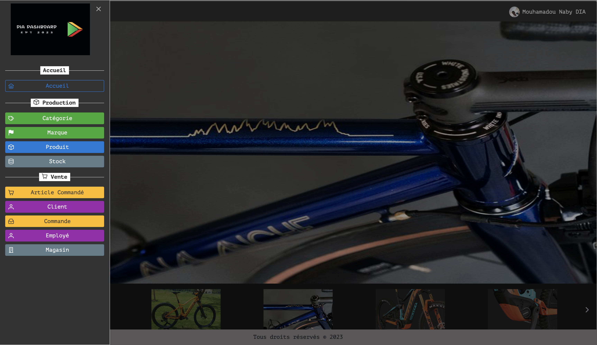
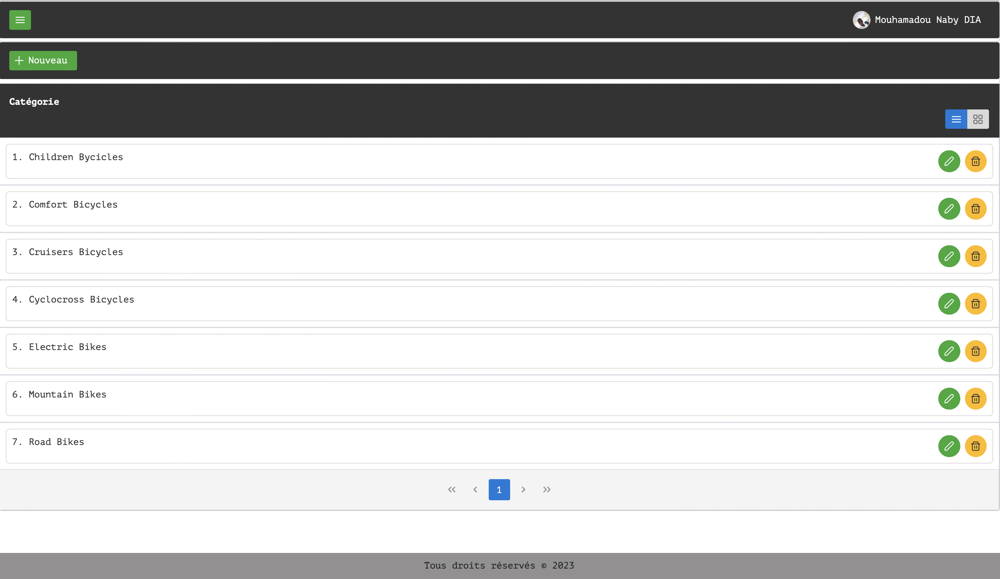
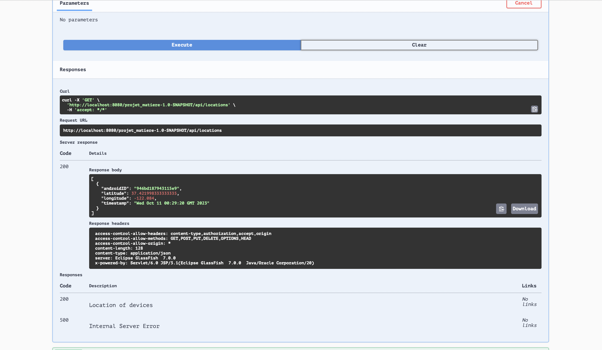
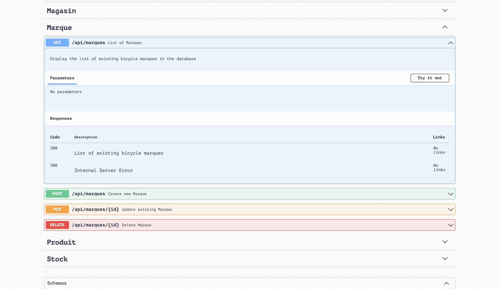
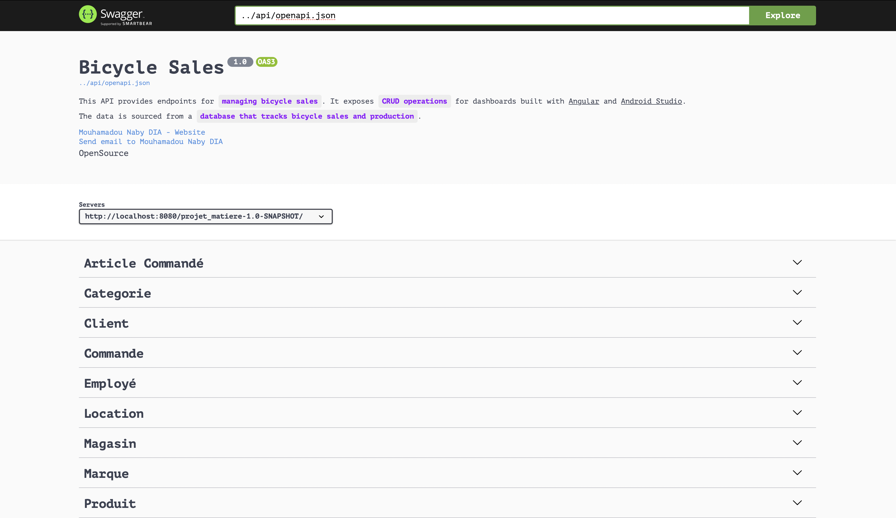
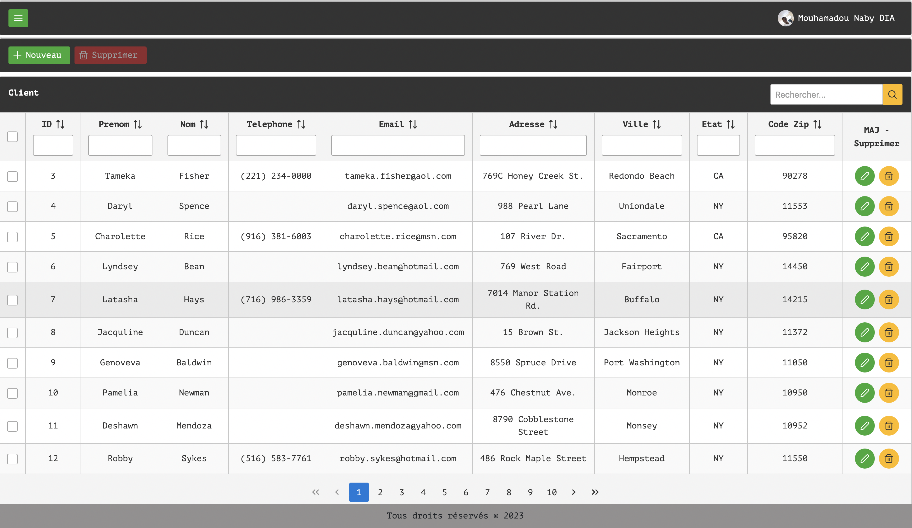
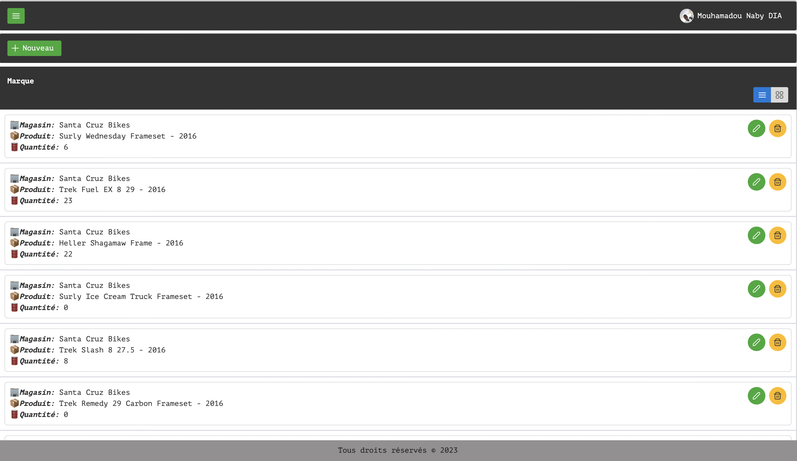
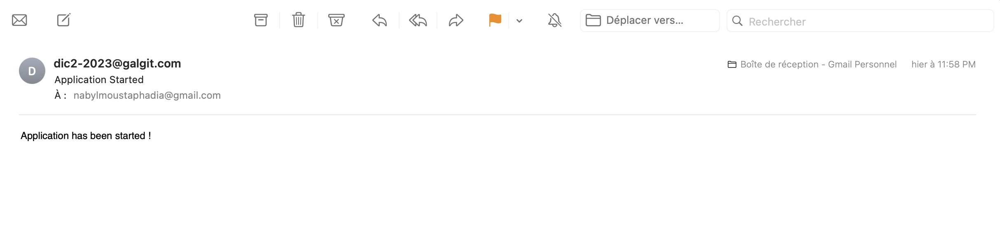
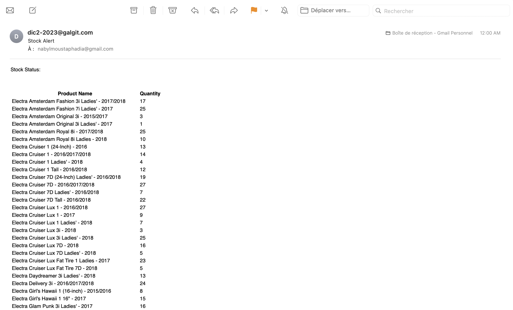

# Projet-Matiere-J2E

Ceci représente un projet Jakarta EE dans le cadre du projet du cours de JEE.

Nous avons :
* du JPA pour la persistance des données avec un mapping de données existantes fournit dans une BD MySQL.
* un système d'alertes par mail lorsque le serveur s'arrête ou redemarre et également un envoi périodique (toutes les 30mn) par mail de l'état des stocks de produits.
* des interfaces web JSF pour le CRUD des entités.
* un service web restful documenté avec swagger pour des clients externes oomme une application angular ou une application mobile.

[Complete Demo](https://drive.google.com/file/d/1rU75WlSSbSN83gdDAUZ_i9IrBZ0G9m9o/view?usp=share_link) 

## Images

